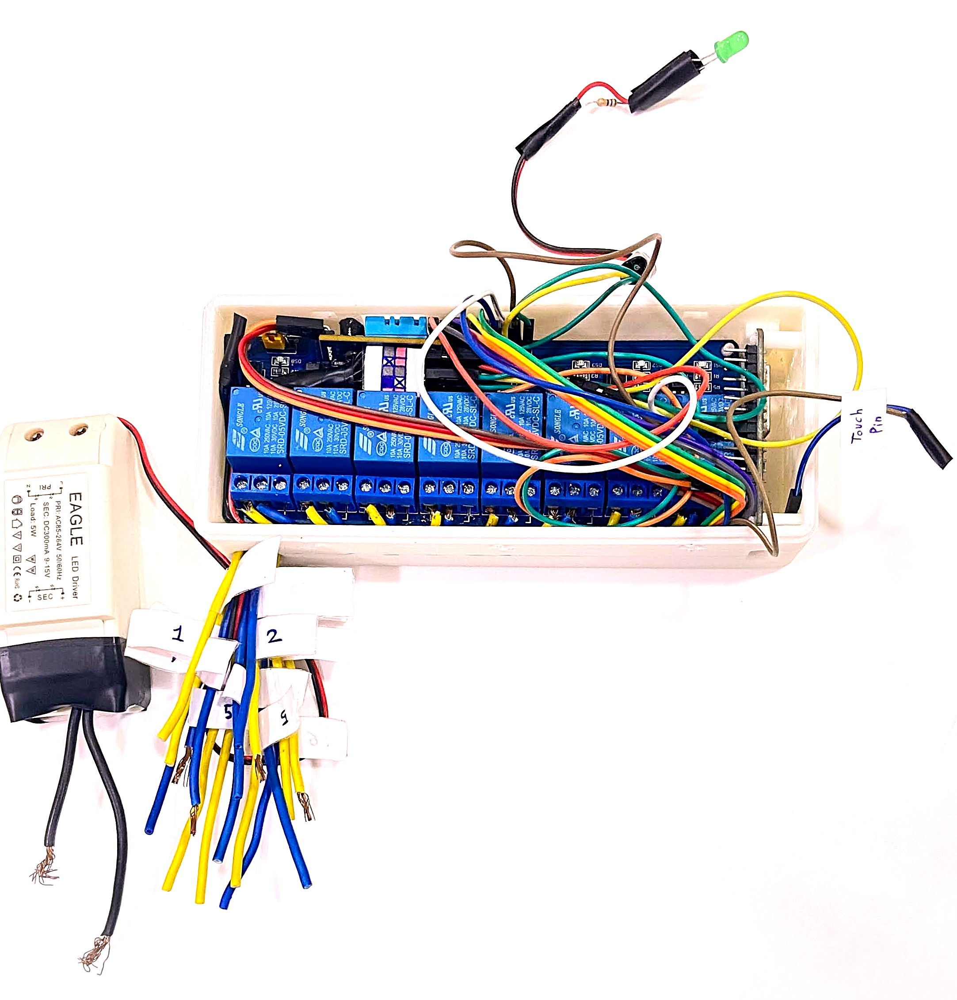

# 🚀 ALIE: Artificially Linked Intelligent Entity


---

## 📖 Table of Contents

- [Overview](#overview)
- [Introduction](#introduction)
- [What Sets ALIE Apart](#what-sets-alie-apart)
- [Features & Capabilities](#features--capabilities)
- [System Architecture & Technologies Used](#system-architecture--technologies-used)
  - [Hardware](#hardware)
  - [Embedded Software](#embedded-software)
  - [Networking & Security](#networking--security)
  - [API & Cloud Integration](#api--cloud-integration)
  - [Web & Mobile Interfaces](#web--mobile-interfaces)
- [How It Works](#how-it-works)
- [Workflow](#workflow)
- [Setup & Installation](#setup--installation)
- [Configuration](#configuration)
- [Usage](#usage)
- [Deployment & Testing](#deployment--testing)
- [Contributing](#contributing)
- [Contact](#contact)
- [Roadmap](#roadmap)
- [FAQ](#faq)

---

## 💡 Overview

**ALIE** (Artificially Linked Intelligent Entity) is a full-stack, production-grade IoT automation platform designed for real-time, secure, and intelligent control of smart environments. Unlike typical DIY projects, ALIE is engineered as a robust product, blending advanced embedded systems, cloud integration, and immersive user interfaces to deliver seamless, multi-modal control and monitoring.

---

## 📝 Introduction

ALIE is a next-generation smart automation system built on the ESP32 platform, leveraging FreeRTOS, MQTT, and end-to-end encryption. It supports voice, touch, web, mobile, and even BCI (Brain-Computer Interface) controls, with real-time cloud synchronization and OTA updates. The system is designed for reliability, extensibility, and immersive user experience, making it suitable for both home and industrial automation.

---

## 🏆 What Sets ALIE Apart

- **Product-Grade Engineering:** Not just a project, but a scalable, maintainable, and customizable product.
- **Multi-Modal Control:** Voice (Alexa/Google Home), NFC/RFID, touch, web, mobile, and BCI.
- **Real-Time & Secure:** Fast response (25ms latency reduction), end-to-end encryption, OTA updates.
- **Cloud-Connected:** Bi-directional sync with Firebase, remote scheduling, and monitoring.
- **Immersive UI:** 3D React dashboard, live camera streams, music playback, and more.
- **Smart & Resilient:** Auto-resynchronization, deep sleep for energy saving, and robust error handling.
- **Custom Hardware:** 3D-printed casing designed in Fusion 360 and Blender.

---

## ✨ Features & Capabilities

- Real-time embedded control with FreeRTOS and MQTT
- End-to-end encrypted communication
- OTA firmware updates
- Alexa/Google Home voice integration (via ESPalexa & webhooks)
- NFC/RFID authentication
- Touch, web, and mobile app control (Blynk IoT)
- Cloud sync with Firebase Firestore
- 3D React dashboard (ThreeJS, model-viewer)
- Remote scheduling and automation
- DHT11/22 sensor for temperature/humidity
- AQI and weather monitoring (Accuweather API)
- Deep sleep and energy-saving modes
- Ad-hoc networking for offline regions
- Live camera streaming and music playback
- Modular, customizable, and extensible

---

## 🛠️ System Architecture & Technologies Used

### Hardware

- **ESP32** microcontroller (dual-core, WiFi/BLE, FreeRTOS)
- **DHT11/22** sensor (temperature/humidity)
- **NFC/RFID** module (optional)
- **Relay modules** for appliance control
- **Custom 3D-printed casing** (Fusion 360, Blender)
- **Touch sensors** for local control




### Embedded Software

- **FreeRTOS** for real-time task scheduling and ISR handling
- **MQTT** for lightweight, secure messaging
- **ESPAsyncWebServer** for RESTful APIs and OTA updates
- **Blynk IoT** for mobile app integration
- **ESPalexa** for Alexa/Google Home voice control
- **End-to-End Encryption** for all communications

### Networking & Security

- **Ad-hoc WiFi networking** for offline operation
- **WAN support** for remote access
- **TLS/SSL** for secure API endpoints
- **Firewall and access control** via NFC/RFID and user authentication

### API & Cloud Integration

- **Firebase Firestore** for real-time cloud sync and remote scheduling
- **Accuweather API** for weather and AQI alerts
- **Webhooks** for voice assistant integration

### Web & Mobile Interfaces

- **React** (with ThreeJS, model-viewer) for 3D dashboard
- **Blynk** mobile app for iOS/Android
- **Bootstrap, GSAP, jQuery** for responsive, animated UI
- **Live camera streaming** and music playback via web interface


---

## ⚙️ How It Works

1. **Device boots up** and connects to WiFi (ad-hoc or WAN).
2. **Sensors and relays** are initialized; FreeRTOS tasks manage device logic.
3. **User interacts** via web/mobile/voice/touch/BCI.
4. **Commands are processed** locally or sent securely to the cloud (Firebase).
5. **Device state is updated** in real-time across all interfaces.
6. **Scheduling, automation, and alerts** are handled via cloud and local logic.
7. **OTA updates** and error handling ensure reliability and security.

---

## 🧩 Workflow

1. **Setup:** Device is configured via web/mobile interface or NFC.
2. **Control:** User can control appliances, monitor sensors, and schedule tasks.
3. **Sync:** All changes are synced with Firebase for remote access and backup.
4. **Automation:** Scheduled events and smart triggers automate environment.
5. **Monitoring:** Real-time dashboard provides immersive visualization and alerts.
6. **Energy Saving:** Device enters deep sleep when idle, wakes on event.

---

## 📦 Setup & Installation

### Hardware

1. Assemble ESP32, relays, sensors, and optional NFC/RFID modules.
2. Print and assemble the custom casing ([see images/hardware/](images/hardware/)).
3. Power up the device.

### Firmware

1. Install [PlatformIO](https://platformio.org/) in VSCode.
2. Clone this repo and open in VSCode.
3. Configure `platformio.ini` as needed.
4. Build and upload firmware to ESP32:
   ```sh
   pio run --target upload
   ```
5. Monitor serial output for debugging and configuration info:
   ```sh
   pio device monitor
   ```

### Configuration

- Edit `src/config/app_config.h` to set up WiFi, Firebase, and other parameters.
- Use `src/config/wifi_config.h` for WiFi credentials (SSID, password).
- Configure Firebase in the Firebase console; download `google-services.json` and place it in the `src` directory.

---

## 📚 Usage

- **Web Interface:** Access the 3D dashboard, control devices, and monitor status at `http://<device_ip>`.
- **Mobile App:** Use the Blynk app to control devices and receive notifications.
- **Voice Control:** Integrate with Alexa or Google Home for voice commands.
- **Touch Control:** Use the touch sensors on the device for local control.

---

## 🧪 Deployment & Testing

- For production, use a reliable power source and consider a UPS for backup.
- Test all functionalities, including OTA updates, cloud sync, and automation.
- Monitor system performance and logs for any anomalies.

---

## 🤝 Contributing

Contributions are welcome! Please follow these steps:

1. Fork the repository.
2. Create a new branch for your feature or bugfix.
3. Make your changes and commit them.
4. Push to your forked repository.
5. Create a pull request describing your changes.

---

## 📞 Contact

For any inquiries or support, please contact:

- **Kalp Thakkar** - [kalpthakkar2001@gmail.com](mailto:kalpthakkar2001@gmail.com)
- **GitHub**: [kalpthakkar](https://github.com/kalpthakkar)
- **LinkedIn**: [kalpthakkar](https://linkedin.com/in/kalpthhakkar)

---

## 📅 Roadmap

Planned features and improvements:

- Expand BCI integration for hands-free control
- Add more sensor support (CO2, motion, etc.)
- Enhance AI-driven automation and anomaly detection
- Expand mobile app features
- Integrate more third-party APIs
- Enhanced AI algorithms for smarter automation
- Broader device compatibility and integration
- Advanced security features and encryption methods
- Improved user interface and user experience design
- Expanded cloud services and data analytics capabilities

---

## ❓ FAQ

**Q1: What is ALIE?**
A1: ALIE is a full-stack IoT automation platform for smart environments, offering real-time control and monitoring.

**Q2: What makes ALIE different from other smart home solutions?**
A2: ALIE is engineered as a product, not just a project. It features multi-modal control, real-time cloud synchronization, and a robust, extensible architecture.

**Q3: How can I contribute to the ALIE project?**
A3: You can contribute by reporting issues, suggesting features, or submitting code changes via pull requests on GitHub.

**Q4: Where can I find documentation and support?**
A4: Documentation is available in the `docs` directory and on the [PlatformIO Unit Testing page](https://docs.platformio.org/page/plus/unit-testing.html). Support can be obtained via email or forum links provided in the Contact section.

**Q5: Is the web app included here the live version?**
A5: The `web-app/` folder contains static reference versions. The production web app is deployed on Firebase for optimal performance and security.

**Q6: Can I use ALIE offline?**
A6: Yes, ALIE supports ad-hoc networking for regions without internet.

**Q7: How do I update the firmware?**
A7: Use the OTA update feature via the web dashboard.

**Q8: What is the roadmap for ALIE?**
A8: The roadmap includes enhanced AI algorithms, broader device compatibility, advanced security features, improved UI/UX design, and expanded cloud services.

**Q9: Is ALIE customizable?**
A9: Absolutely! The system is modular and can be extended for new devices, sensors, and interfaces.
